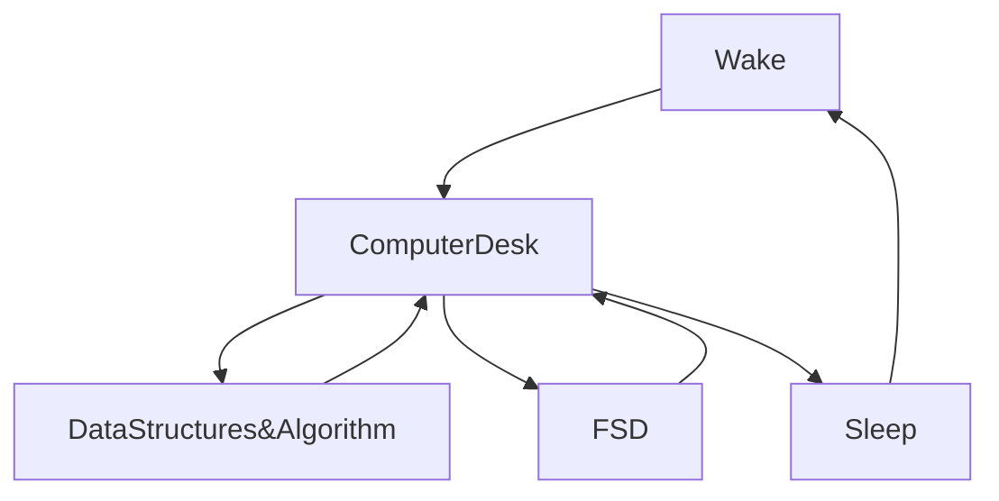

 <link rel="stylesheet" href="https://cdn.jsdelivr.net/gh/devicons/devicon@v2.15.1/devicon.min.css">

[](https://git.io/typing-svg)

<div style='width:100%; ' >


</div>
<br>
<br>
<br>
<br>
<br>


[](https://wakatime.com/@fc738f08-9e9d-4e8b-a6ea-7f547f91629d)

<h2>Hey 👋, I'm <a href="https://github.com/IshwaranRudhara">Ishwaran</a> </h2>
<a href="#"></a>

[](https://git.io/typing-svg)

<!--START_SECTION:waka-->


**🐱 My GitHub Data**

> 📦 1.9 MB Used in GitHub's Storage
>
> 🏆 310 Contributions in the Year 2023
>
> 💼 Opted to Hire
>
> 📜 132 Public Repositories
>
> 🔑 176 Private Repositories
>
> **I'm an Early 🐤**

```text
🌞 Morning                34 commits          ░░░░░░░░░░░░░░░░░░░░░░░░░   00.13 %
🌆 Daytime                24347 commits       ██████████████████████░░░   89.80 %
🌃 Evening                769 commits         █░░░░░░░░░░░░░░░░░░░░░░░░   02.84 %
🌙 Night                  1961 commits        ██░░░░░░░░░░░░░░░░░░░░░░░   07.23 %
```

📅 **I'm Most Productive on Sunday**

```text
Monday                   999 commits         █░░░░░░░░░░░░░░░░░░░░░░░░   03.68 %
Tuesday                  385 commits         ░░░░░░░░░░░░░░░░░░░░░░░░░   01.42 %
Wednesday                162 commits         ░░░░░░░░░░░░░░░░░░░░░░░░░   00.60 %
Thursday                 286 commits         ░░░░░░░░░░░░░░░░░░░░░░░░░   01.05 %
Friday                   545 commits         █░░░░░░░░░░░░░░░░░░░░░░░░   02.01 %
Saturday                 360 commits         ░░░░░░░░░░░░░░░░░░░░░░░░░   01.33 %
Sunday                   24374 commits       ██████████████████████░░░   89.90 %
```

📊 **This Week I Spent My Time On**

```text
🕑︎ Time Zone: Asia/Kolkata

💬 Programming Languages:
Markdown                 56 mins             ████████████████░░░░░░░░░   65.53 %
YAML                     21 mins             ██████░░░░░░░░░░░░░░░░░░░   25.01 %
Other                    4 mins              █░░░░░░░░░░░░░░░░░░░░░░░░   05.56 %
XML                      2 mins              █░░░░░░░░░░░░░░░░░░░░░░░░   02.50 %
HTML                     1 min               ░░░░░░░░░░░░░░░░░░░░░░░░░   01.40 %

🔥 Editors:
VS Code                  1 hr 26 mins        █████████████████████████   100.00 %

💻 Operating System:
Windows                  1 hr 26 mins        █████████████████████████   100.00 %
```

**I Mostly Code in Python**

```text
Python                   132 repos           █████████████████░░░░░░░░   66.33 %
HTML                     31 repos            ████░░░░░░░░░░░░░░░░░░░░░   15.58 %
JavaScript               20 repos            ███░░░░░░░░░░░░░░░░░░░░░░   10.05 %
CSS                      4 repos             █░░░░░░░░░░░░░░░░░░░░░░░░   02.01 %
Batchfile                1 repo              ░░░░░░░░░░░░░░░░░░░░░░░░░   00.50 %
```

-<!-- Languages and Tools -->

<h2 style="color: #44AEFB">⚙️ Languages and Tools</h2>
<div align="center" style="display:block;">
     
</div>
<br>   
<!-- Icons Resources -->
<!-- https://devicon.dev/ -->
<!-- https://cdn.jsdelivr.net/npm/simple-icons@v3/icons/ -->
<div align="center">
  <a href="https://developer.mozilla.org/en-US/docs/Web/JavaScript" target="_blank" rel="noreferrer">
      
  </a>
  
  <a href="https://reactjs.org/" target="_blank" rel="noreferrer">
      
  </a>
  <a href="https://nodejs.org/en/" target="_blank" rel="noreferrer">
      
  </a>
  <a href="https://www.raspberrypi.org" target="_blank"rel="noreferrer" > 
      
    </a> 
         
  <a href="https://developer.mozilla.org/en-US/docs/Web/HTML" target="_blank" rel="noreferrer">
      
  </a>
  <a href="https://developer.mozilla.org/en-US/docs/Web/CSS" target="_blank" rel="noreferrer">
      
  </a>
  <a href="https://getbootstrap.com/" target="_blank" rel="noreferrer">
      
  </a>

  <a href="https://sass-lang.com/" target="_blank" rel="noreferrer">
      
  </a>
     
  <a href="https://www.python.org/" target="_blank" rel="noreferrer">
      
  </a>
  </a>
  <a href="https://kotlinlang.org/" target="_blank" rel="noreferrer">
      
  </a>
  <a href="https://firebase.google.com/" target="_blank" rel="noreferrer">
      
  </a>
  <a href="https://cloud.google.com/" target="_blank" rel="noreferrer">
       
  </a>
  <a href="https://git-scm.com/" target="_blank" rel="noreferrer">
      
  </a>
  <a href="https://www.graphql.com/" target="_blank" rel="noreferrer">
      
  </a>
  <a href="https://www.mongodb.com/" target="_blank" rel="noreferrer">
      
  </a>
  <a href="https://www.sqlite.org/index.html" target="_blank" rel="noreferrer">
      
  </a>
  <a href="https://www.npmjs.com/" target="_blank" rel="noreferrer">
      
  </a>
  <a href="https://www.docker.com/" target="_blank" rel="noreferrer">
      
  </a>
  <a href="https://code.visualstudio.com/" target="_blank" rel="noreferrer">
      
  </a>
  <a href="http://jupyter.org/" target="_blank" rel="noreferrer">
      
  </a>
  <a href="https://www.figma.com/" target="_blank" rel="noreferrer">
       
  </a>
  <a href="https://www.canva.com/" target="_blank" rel="noreferrer">
       
  </a>
</div>
<br>
<br>

**Timeline**


Last Updated on 24/07/2023 18:42:16 UTC

<!--END_SECTION:waka-->

```javascript

```


[](https://git.io/streak-stats)

[](https://github.com/anuraghazra/github-readme-stats)


<H2>My Routine Since JAN 2021</H2>




[](https://github.com/ashutosh00710/github-readme-activity-graph)


##STOCK EXCHANGE


##TIME

##GEOGRAPHERS


##CURRENCY EXCHANGE


<!--
**IshwaranRudhara/IshwaranRudhara** is a ✨ _special_ ✨ repository because its `README.md` (this file) appears on your GitHub profile.

Here are some ideas to get you started:

- 🔭 I’m currently working on ...
- 🌱 I’m currently learning ...
- 👯 I’m looking to collaborate on ...
- 🤔 I’m looking for help with ...
- 💬 Ask me about ...
- 📫 How to reach me: ...
- 😄 Pronouns: ...
- ⚡ Fun fact: ...
-->
