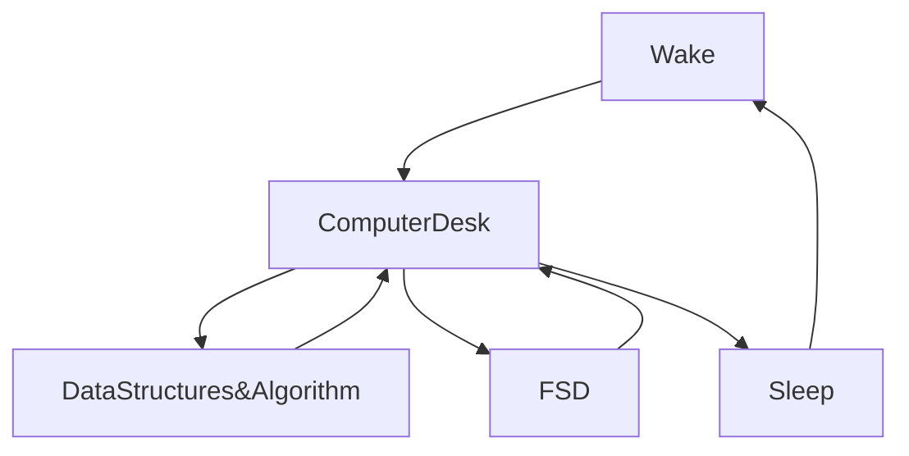

[](https://git.io/typing-svg)


[](https://wakatime.com/@fc738f08-9e9d-4e8b-a6ea-7f547f91629d)

<h2>Hey 👋, I'm <a href="https://github.com/IshwaranRudhara">Ishwaran</a> </h2>

[](https://git.io/typing-svg)


<!--START_SECTION:waka-->


**🐱 My GitHub Data** 

> 🏆 103 Contributions in the Year 2023
 > 
> 📦 860.2 kB Used in GitHub's Storage 
 > 
> 💼 Opted to Hire
 > 
> 📜 106 Public Repositories 
 > 
> 🔑 167 Private Repositories  
 > 
**I'm an Early 🐤** 

```text
🌞 Morning       13 commits       █░░░░░░░░░░░░░░░░░░░░░░░░   04.63 % 
🌆 Daytime      148 commits       █████████████░░░░░░░░░░░░   52.67 % 
🌃 Evening       87 commits       ███████░░░░░░░░░░░░░░░░░░   30.96 % 
🌙 Night         33 commits       ███░░░░░░░░░░░░░░░░░░░░░░   11.74 % 

```
📅 **I'm Most Productive on Sunday** 

```text
Monday          32 commits       ██░░░░░░░░░░░░░░░░░░░░░░░   11.39 % 
Tuesday         37 commits       ███░░░░░░░░░░░░░░░░░░░░░░   13.17 % 
Wednesday       18 commits       █░░░░░░░░░░░░░░░░░░░░░░░░   06.41 % 
Thursday        14 commits       █░░░░░░░░░░░░░░░░░░░░░░░░   04.98 % 
Friday          15 commits       █░░░░░░░░░░░░░░░░░░░░░░░░   05.34 % 
Saturday        32 commits       ██░░░░░░░░░░░░░░░░░░░░░░░   11.39 % 
Sunday         133 commits       ███████████░░░░░░░░░░░░░░   47.33 % 

```


📊 **This Week I Spent My Time On** 

```text
⌚︎ Time Zone: Asia/Kolkata

💬 Programming Languages: 
Other                    16 hrs 57 mins      █████████████████░░░░░░░░   70.18 % 
HTML                     4 hrs 10 mins       ████░░░░░░░░░░░░░░░░░░░░░   17.24 % 
CSS                      3 hrs 1 min         ███░░░░░░░░░░░░░░░░░░░░░░   12.49 % 
JSON                     1 min               ░░░░░░░░░░░░░░░░░░░░░░░░░   00.09 % 

🔥 Editors: 
Browser                  16 hrs 57 mins      █████████████████░░░░░░░░   70.17 % 
VS Code                  7 hrs 12 mins       ███████░░░░░░░░░░░░░░░░░░   29.83 % 

💻 Operating System: 
Windows                  24 hrs 10 mins      █████████████████████████   100.00 % 

```

**I Mostly Code in Python** 

```text
Python                   48 repos            ██████████████░░░░░░░░░░░   55.81 % 
HTML                     18 repos            █████░░░░░░░░░░░░░░░░░░░░   20.93 % 
JavaScript               14 repos            ████░░░░░░░░░░░░░░░░░░░░░   16.28 % 
CSS                      2 repos             ░░░░░░░░░░░░░░░░░░░░░░░░░   02.33 % 
Dockerfile               1 repo              ░░░░░░░░░░░░░░░░░░░░░░░░░   01.16 % 

```


**Timeline**

 


 Last Updated on 19/02/2023 05:33:49 UTC
<!--END_SECTION:waka-->

```javascript


```


[](https://git.io/streak-stats)

[](https://github.com/anuraghazra/github-readme-stats)


<H2>My Routine Since JAN 2021</H2>


[](https://github.com/ashutosh00710/github-readme-activity-graph)


<!--
**IshwaranRudhara/IshwaranRudhara** is a ✨ _special_ ✨ repository because its `README.md` (this file) appears on your GitHub profile.

Here are some ideas to get you started:

- 🔭 I’m currently working on ...
- 🌱 I’m currently learning ...
- 👯 I’m looking to collaborate on ...
- 🤔 I’m looking for help with ...
- 💬 Ask me about ...
- 📫 How to reach me: ...
- 😄 Pronouns: ...
- ⚡ Fun fact: ...
-->
