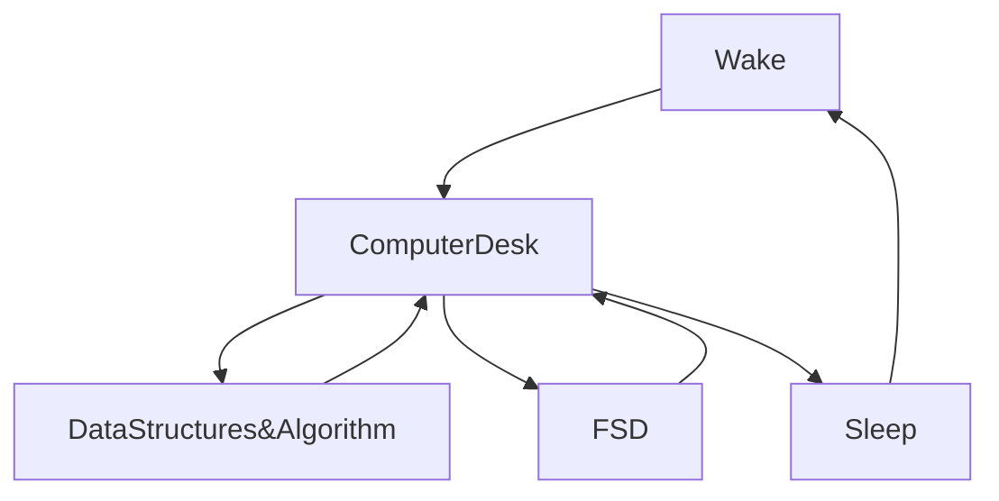

[](https://git.io/typing-svg)


[](https://wakatime.com/@fc738f08-9e9d-4e8b-a6ea-7f547f91629d)

<h2>Hey 👋, I'm <a href="https://github.com/IshwaranRudhara">Ishwaran</a> </h2>

[](https://git.io/typing-svg)


<!--START_SECTION:waka-->


**🐱 My GitHub Data** 

> 📦 982.1 kB Used in GitHub's Storage 
 > 
> 🏆 132 Contributions in the Year 2023
 > 
> 💼 Opted to Hire
 > 
> 📜 107 Public Repositories 
 > 
> 🔑 169 Private Repositories 
 > 
**I'm an Early 🐤** 

```text
🌞 Morning                14 commits          ░░░░░░░░░░░░░░░░░░░░░░░░░   00.06 % 
🌆 Daytime                23904 commits       █████████████████████████   99.31 % 
🌃 Evening                97 commits          ░░░░░░░░░░░░░░░░░░░░░░░░░   00.40 % 
🌙 Night                  56 commits          ░░░░░░░░░░░░░░░░░░░░░░░░░   00.23 % 
```
📅 **I'm Most Productive on Sunday** 

```text
Monday                   37 commits          ░░░░░░░░░░░░░░░░░░░░░░░░░   00.15 % 
Tuesday                  44 commits          ░░░░░░░░░░░░░░░░░░░░░░░░░   00.18 % 
Wednesday                19 commits          ░░░░░░░░░░░░░░░░░░░░░░░░░   00.08 % 
Thursday                 18 commits          ░░░░░░░░░░░░░░░░░░░░░░░░░   00.07 % 
Friday                   19 commits          ░░░░░░░░░░░░░░░░░░░░░░░░░   00.08 % 
Saturday                 35 commits          ░░░░░░░░░░░░░░░░░░░░░░░░░   00.15 % 
Sunday                   23899 commits       █████████████████████████   99.29 % 
```


📊 **This Week I Spent My Time On** 

```text
🕑︎ Time Zone: Asia/Kolkata

💬 Programming Languages: 
HTML                     6 hrs 32 mins       ███████████████░░░░░░░░░░   59.82 % 
CSS                      4 hrs 12 mins       ██████████░░░░░░░░░░░░░░░   38.51 % 
JSON                     10 mins             ░░░░░░░░░░░░░░░░░░░░░░░░░   01.54 % 
Other                    0 secs              ░░░░░░░░░░░░░░░░░░░░░░░░░   00.09 % 
JavaScript               0 secs              ░░░░░░░░░░░░░░░░░░░░░░░░░   00.03 % 

🔥 Editors: 
VS Code                  10 hrs 56 mins      █████████████████████████   100.00 % 

💻 Operating System: 
Windows                  10 hrs 56 mins      █████████████████████████   100.00 % 
```

**I Mostly Code in Python** 

```text
Python                   131 repos           ██████████████████░░░░░░░   71.58 % 
HTML                     24 repos            ███░░░░░░░░░░░░░░░░░░░░░░   13.11 % 
JavaScript               16 repos            ██░░░░░░░░░░░░░░░░░░░░░░░   08.74 % 
CSS                      3 repos             ░░░░░░░░░░░░░░░░░░░░░░░░░   01.64 % 
PHP                      2 repos             ░░░░░░░░░░░░░░░░░░░░░░░░░   01.09 % 
```


**Timeline**


 Last Updated on 06/03/2023 16:50:51 UTC
<!--END_SECTION:waka-->

```javascript


```


[](https://git.io/streak-stats)

[](https://github.com/anuraghazra/github-readme-stats)


<H2>My Routine Since JAN 2021</H2>


[](https://github.com/ashutosh00710/github-readme-activity-graph)


<!--
**IshwaranRudhara/IshwaranRudhara** is a ✨ _special_ ✨ repository because its `README.md` (this file) appears on your GitHub profile.

Here are some ideas to get you started:

- 🔭 I’m currently working on ...
- 🌱 I’m currently learning ...
- 👯 I’m looking to collaborate on ...
- 🤔 I’m looking for help with ...
- 💬 Ask me about ...
- 📫 How to reach me: ...
- 😄 Pronouns: ...
- ⚡ Fun fact: ...
-->
