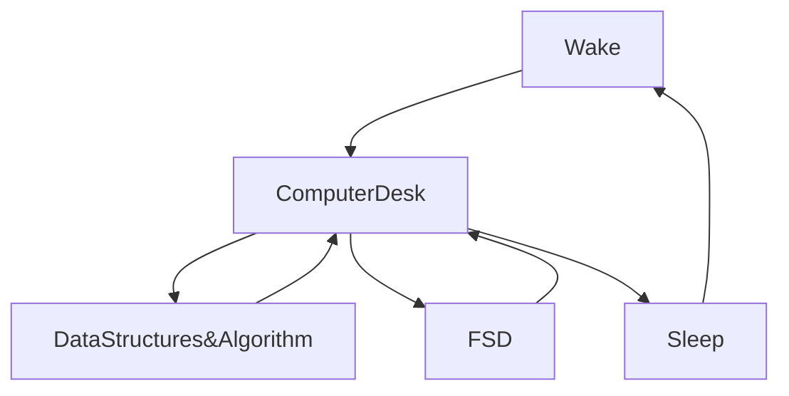

<div align="center">

<p align="center">

<!-- WORK FLOWS  -->

<div  style="width:100%;">


</div>
<!-- work flow ends -->

 <link rel="stylesheet" href="https://cdn.jsdelivr.net/gh/devicons/devicon@v2.15.1/devicon.min.css">

[](https://git.io/typing-svg)

<div style='display:block; width:100%; height:100% ' >
<div>

</div>
<div>

</div>
</div>


[](https://wakatime.com/@fc738f08-9e9d-4e8b-a6ea-7f547f91629d)

<h2>Hey 👋, I'm <a href="https://github.com/IshwaranRudhara">Ishwaran</a> </h2>

<!-- DEV DAILY STARTS -->

<!-- <a href="#"></a> -->

<!-- DEV DAILY ENDS -->

[](https://git.io/typing-svg)

<!--START_SECTION:waka-->


**🐱 My GitHub Data** 

> 📦 1.9 MB Used in GitHub's Storage 
 > 
> 🏆 349 Contributions in the Year 2023
 > 
> 💼 Opted to Hire
 > 
> 📜 132 Public Repositories 
 > 
> 🔑 176 Private Repositories 
 > 
**I'm an Early 🐤** 

```text
🌞 Morning                34 commits          ░░░░░░░░░░░░░░░░░░░░░░░░░   00.13 % 
🌆 Daytime                24347 commits       ██████████████████████░░░   89.55 % 
🌃 Evening                810 commits         █░░░░░░░░░░░░░░░░░░░░░░░░   02.98 % 
🌙 Night                  1997 commits        ██░░░░░░░░░░░░░░░░░░░░░░░   07.35 % 
```
📅 **I'm Most Productive on Sunday** 

```text
Monday                   999 commits         █░░░░░░░░░░░░░░░░░░░░░░░░   03.67 % 
Tuesday                  401 commits         ░░░░░░░░░░░░░░░░░░░░░░░░░   01.47 % 
Wednesday                202 commits         ░░░░░░░░░░░░░░░░░░░░░░░░░   00.74 % 
Thursday                 307 commits         ░░░░░░░░░░░░░░░░░░░░░░░░░   01.13 % 
Friday                   545 commits         ░░░░░░░░░░░░░░░░░░░░░░░░░   02.00 % 
Saturday                 360 commits         ░░░░░░░░░░░░░░░░░░░░░░░░░   01.32 % 
Sunday                   24374 commits       ██████████████████████░░░   89.65 % 
```


📊 **This Week I Spent My Time On** 

```text
🕑︎ Time Zone: Asia/Kolkata

💬 Programming Languages: 
Markdown                 4 hrs 2 mins        ████████████████████░░░░░   79.74 % 
YAML                     52 mins             ████░░░░░░░░░░░░░░░░░░░░░   17.24 % 
HTML                     4 mins              ░░░░░░░░░░░░░░░░░░░░░░░░░   01.56 % 
Other                    4 mins              ░░░░░░░░░░░░░░░░░░░░░░░░░   01.40 % 
JSON                     0 secs              ░░░░░░░░░░░░░░░░░░░░░░░░░   00.06 % 

🔥 Editors: 
VS Code                  5 hrs 4 mins        █████████████████████████   100.00 % 

💻 Operating System: 
Windows                  5 hrs 4 mins        █████████████████████████   100.00 % 
```

**I Mostly Code in Python** 

```text
Python                   132 repos           █████████████████░░░░░░░░   66.33 % 
HTML                     31 repos            ████░░░░░░░░░░░░░░░░░░░░░   15.58 % 
JavaScript               20 repos            ███░░░░░░░░░░░░░░░░░░░░░░   10.05 % 
CSS                      4 repos             █░░░░░░░░░░░░░░░░░░░░░░░░   02.01 % 
Batchfile                1 repo              ░░░░░░░░░░░░░░░░░░░░░░░░░   00.50 % 
```


**Timeline**


 Last Updated on 27/07/2023 23:39:13 UTC
<!--END_SECTION:waka-->

```javascript

```

<!-- daily dev paused -->

<!--  -->

<!-- daily dev paused -->

[](https://git.io/streak-stats)


[](https://github.com/anuraghazra/github-readme-stats)


<H2 align="center" style="font-family:Poppins; color:#25b4db;  " >My Routine Since JAN 2021</H2>

<div align="center">



</div>

<div align="center">


</div>

[](https://github.com/ashutosh00710/github-readme-activity-graph)

<!-- SNAKE GIF! STARTS -->


<!-- SNAKE GIF ENDS -->

##STOCK EXCHANGE


##TIME

##GEOGRAPHERS


##CURRENCY EXCHANGE


<!--
**IshwaranRudhara/IshwaranRudhara** is a ✨ _special_ ✨ repository because its `README.md` (this file) appears on your GitHub profile.

Here are some ideas to get you started:

- 🔭 I’m currently working on ...
- 🌱 I’m currently learning ...
- 👯 I’m looking to collaborate on ...
- 🤔 I’m looking for help with ...
- 💬 Ask me about ...
- 📫 How to reach me: ...
- 😄 Pronouns: ...
- ⚡ Fun fact: ...
-->

<!-- BLOG-POST-LIST:START -->
- [The Witcher &lpar;2023&rpar; S03 EP&lpar;06-08&rpar; TRUE WEB-DL - [1080p &amp; 720p - AVC - &lpar;DD+5.1 - 192Kbps&rpar; [Tamil + Telugu + Hindi + Eng] - 5GB - 1.2GB &amp; 500MB] - ESub](https://www.1tamilmv.zip/index.php?/forums/topic/174546-the-witcher-2023-s03-ep06-08-true-web-dl-1080p-720p-avc-dd51-192kbps-tamil-telugu-hindi-eng-5gb-12gb-500mb-esub/&do=findComment&comment=350924)
- [One Friday Night &lpar;2023&rpar; Hindi TRUE WEB-DL - [1080p &amp; 720p - AVC - &lpar;DD5.1 - 384Kbps&rpar; - 2.6GB &amp; 1.3GB] - [x264 - 700MB &amp; 400MB] - ESub](https://www.1tamilmv.zip/index.php?/forums/topic/174551-one-friday-night-2023-hindi-true-web-dl-1080p-720p-avc-dd51-384kbps-26gb-13gb-x264-700mb-400mb-esub/&do=findComment&comment=350923)
- [Samajavaragamana &lpar;2023&rpar; Telugu TRUE WEB-DL - [4K ,1080p &amp; 720p - AVC - &lpar;DD+5.1 - 384Kbps&rpar; - 4.7GB - 2.5GB &amp; 1.3GB] - [x264 - 700MB &amp; 400MB] - ESub](https://www.1tamilmv.zip/index.php?/forums/topic/174548-samajavaragamana-2023-telugu-true-web-dl-4k-1080p-720p-avc-dd51-384kbps-47gb-25gb-13gb-x264-700mb-400mb-esub/&do=findComment&comment=350922)
- [Captain Miller -Teaser | Dhanush | Shivarajkumar, Sundeep Kishan, Priyanka Mohan | Arun Matheswaran](https://www.1tamilmv.zip/index.php?/forums/topic/174554-captain-miller-teaser-dhanush-shivarajkumar-sundeep-kishan-priyanka-mohan-arun-matheswaran/&do=findComment&comment=350921)
- [Dhamaka &lpar;2023&rpar; Tamil TRUE WEB-DL - [1080p &amp; 720p - AVC / HEVC - [Tamil &lpar;Original Audio&rpar; + Telugu] - 2.6GB - 1.4GB &amp; 800MB] - [x264 - 700MB - 400MB &amp; 250MB] - ESub](https://www.1tamilmv.zip/index.php?/forums/topic/174549-dhamaka-2023-tamil-true-web-dl-1080p-720p-avc-hevc-tamil-original-audio-telugu-26gb-14gb-800mb-x264-700mb-400mb-250mb-esub/&do=findComment&comment=350920)
<!-- BLOG-POST-LIST:END -->

# Moon Animation

 <a href="https://moon-svg.minung.dev">
    
  </a>
</div>
