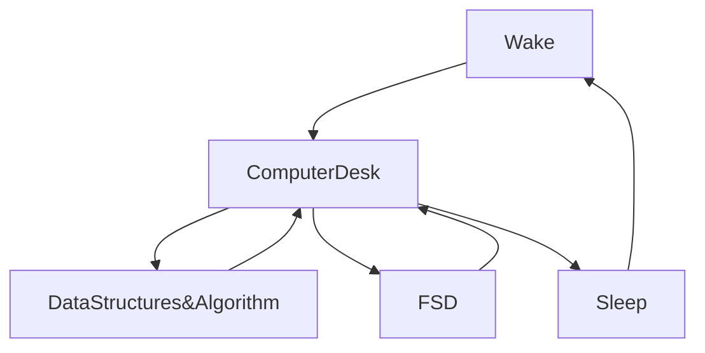

[](https://git.io/typing-svg)


[](https://wakatime.com/@fc738f08-9e9d-4e8b-a6ea-7f547f91629d)

<h2>Hey 👋, I'm <a href="https://github.com/IshwaranRudhara">Ishwaran</a> </h2>

[](https://git.io/typing-svg)


<!--START_SECTION:waka-->


**🐱 My GitHub Data** 

> 🏆 78 Contributions in the Year 2023
 > 
> 📦 857.4 kB Used in GitHub's Storage 
 > 
> 💼 Opted to Hire
 > 
> 📜 103 Public Repositories 
 > 
> 🔑 167 Private Repositories  
 > 
**I'm an Early 🐤** 

```text
🌞 Morning    13 commits     █░░░░░░░░░░░░░░░░░░░░░░░░   4.98% 
🌆 Daytime    148 commits    ██████████████░░░░░░░░░░░   56.7% 
🌃 Evening    77 commits     ███████░░░░░░░░░░░░░░░░░░   29.5% 
🌙 Night      23 commits     ██░░░░░░░░░░░░░░░░░░░░░░░   8.81%

```
📅 **I'm Most Productive on Sunday** 

```text
Monday       31 commits     ███░░░░░░░░░░░░░░░░░░░░░░   11.88% 
Tuesday      34 commits     ███░░░░░░░░░░░░░░░░░░░░░░   13.03% 
Wednesday    17 commits     █░░░░░░░░░░░░░░░░░░░░░░░░   6.51% 
Thursday     9 commits      ░░░░░░░░░░░░░░░░░░░░░░░░░   3.45% 
Friday       15 commits     █░░░░░░░░░░░░░░░░░░░░░░░░   5.75% 
Saturday     31 commits     ███░░░░░░░░░░░░░░░░░░░░░░   11.88% 
Sunday       124 commits    ████████████░░░░░░░░░░░░░   47.51%

```


📊 **This Week I Spent My Time On** 

```text
⌚︎ Time Zone: Asia/Kolkata

💬 Programming Languages: 
Other                    34 hrs 31 mins      ███████████████████████░░   93.45% 
HTML                     1 hr 12 mins        ░░░░░░░░░░░░░░░░░░░░░░░░░   3.25% 
JavaScript               30 mins             ░░░░░░░░░░░░░░░░░░░░░░░░░   1.36% 
CSS                      28 mins             ░░░░░░░░░░░░░░░░░░░░░░░░░   1.28% 
Markdown                 11 mins             ░░░░░░░░░░░░░░░░░░░░░░░░░   0.54%

🔥 Editors: 
Browser                  34 hrs 28 mins      ███████████████████████░░   93.33% 
VS Code                  2 hrs 27 mins       █░░░░░░░░░░░░░░░░░░░░░░░░   6.67%

💻 Operating System: 
Windows                  36 hrs 56 mins      █████████████████████████   100.0%

```

**I Mostly Code in Python** 

```text
Python                   49 repos            ██████████████░░░░░░░░░░░   57.65% 
HTML                     16 repos            ████░░░░░░░░░░░░░░░░░░░░░   18.82% 
JavaScript               13 repos            ███░░░░░░░░░░░░░░░░░░░░░░   15.29% 
Dockerfile               2 repos             ░░░░░░░░░░░░░░░░░░░░░░░░░   2.35% 
CSS                      2 repos             ░░░░░░░░░░░░░░░░░░░░░░░░░   2.35%

```


**Timeline**

 


 Last Updated on 05/02/2023 03:40:45 UTC
<!--END_SECTION:waka-->

```javascript


```


[](https://git.io/streak-stats)

[](https://github.com/anuraghazra/github-readme-stats)


<H2>My Routine Since JAN 2021</H2>


[](https://github.com/ashutosh00710/github-readme-activity-graph)


<!--
**IshwaranRudhara/IshwaranRudhara** is a ✨ _special_ ✨ repository because its `README.md` (this file) appears on your GitHub profile.

Here are some ideas to get you started:

- 🔭 I’m currently working on ...
- 🌱 I’m currently learning ...
- 👯 I’m looking to collaborate on ...
- 🤔 I’m looking for help with ...
- 💬 Ask me about ...
- 📫 How to reach me: ...
- 😄 Pronouns: ...
- ⚡ Fun fact: ...
-->
