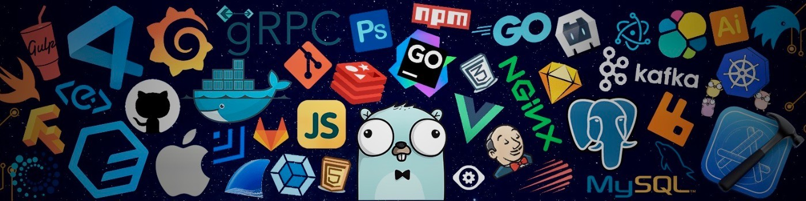
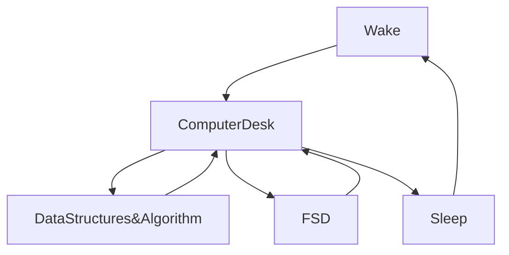

<!-- ADVICE:START -->
<p align="center"><br><i>Today, do not use the words "Kind of", "Sort of" or "Maybe". It either is or it isn't.</i><br></p>
<!-- ADVICE:END -->

[](https://git.io/typing-svg)



<div align="center">

<p align="center">

<!-- WORK FLOWS  -->


</div>
<!-- work flow ends -->

 <link rel="stylesheet" href="https://cdn.jsdelivr.net/gh/devicons/devicon@v2.15.1/devicon.min.css">

[](https://git.io/typing-svg)

<div style='display:block; width:100%; height:100% ' >
<div>

</div>
<div>

</div>
</div>


[](https://wakatime.com/@fc738f08-9e9d-4e8b-a6ea-7f547f91629d)

<br>
<br>
<br>
<br>
<br>
<br>
<br>
<br>
<br>
<br>
<br>
<br>
<br>
<br>
<br>
<br>
<br>
<br>
<br>
<br>
<br>
<br>
<br>
<details  align="center">
<summary  style="font-size:30px; color:#03989EFF">Technologies and Tools</summary>
<br>                     
<p  align="center">


</p>
<p  align="center">


</p>
<p  align="center">


</p>
<p  align="center">


</p>
<p  align="center">


</p>
</details>

<details  align="center">
<summary  style="font-size:25px; color:#03989EFF">Graphics Design</summary>
<br>
<p  align="center">


</p>
</details>

<details  align="center">
<summary  style="font-size:25px; color:#03989EFF">Learning Tools and Platforms</summary>
<br>
<p  align="center">


</p>
</details>
                                                                                                                 
<details  align="center">
<summary  style="font-size:25px; color:#03989EFF">Gaming Platforms and Technologies</summary>
<br>
<p  align="center">


</p>
</details>

## 📈 GitHub Stats

<p align="center">
    
    
</p>

## 🔝 Languages Stats

<p align="center">


</p>

## 🏆 GitHub Trophies


### ✍️ Random Dev Quote


### 🔝 Top Contributed Repo


### 😂 Random Dev Meme


---

[](https://visitcount.itsvg.in)

## 💰 You can help me by Donating

[](https://buymeacoffee.com/https://www.buymeacoffee.com/ishwaran) [](https://patreon.com/https://www.patreon.com/user?u=13123935) [](https://ko-fi.com/https://ko-fi.com/ishwaran)

<!-- Proudly created with GPRM ( https://gprm.itsvg.in ) -->

<!-- <h2>Hey 👋, I'm <a href="https://github.com/IshwaranRudhara">Ishwaran</a> </h2> -->

<!-- DEV DAILY STARTS -->

<!-- <a href="#"></a> -->

<!-- DEV DAILY ENDS -->

[](https://git.io/typing-svg)

<!--START_SECTION:waka-->


**🐱 My GitHub Data** 

> 📦 5.1 MB Used in GitHub's Storage 
 > 
> 🏆 491 Contributions in the Year 2024
 > 
> 💼 Opted to Hire
 > 
> 📜 143 Public Repositories 
 > 
> 🔑 186 Private Repositories 
 > 
**I'm an Early 🐤** 

```text
🌞 Morning                140 commits         ░░░░░░░░░░░░░░░░░░░░░░░░░   00.50 % 
🌆 Daytime                24494 commits       ██████████████████████░░░   87.93 % 
🌃 Evening                1058 commits        █░░░░░░░░░░░░░░░░░░░░░░░░   03.80 % 
🌙 Night                  2163 commits        ██░░░░░░░░░░░░░░░░░░░░░░░   07.77 % 
```
📅 **I'm Most Productive on Sunday** 

```text
Monday                   1079 commits        █░░░░░░░░░░░░░░░░░░░░░░░░   03.87 % 
Tuesday                  473 commits         ░░░░░░░░░░░░░░░░░░░░░░░░░   01.70 % 
Wednesday                291 commits         ░░░░░░░░░░░░░░░░░░░░░░░░░   01.04 % 
Thursday                 400 commits         ░░░░░░░░░░░░░░░░░░░░░░░░░   01.44 % 
Friday                   665 commits         █░░░░░░░░░░░░░░░░░░░░░░░░   02.39 % 
Saturday                 466 commits         ░░░░░░░░░░░░░░░░░░░░░░░░░   01.67 % 
Sunday                   24481 commits       ██████████████████████░░░   87.89 % 
```


📊 **This Week I Spent My Time On** 

```text
🕑︎ Time Zone: Asia/Kolkata

💬 Programming Languages: 
Other                    13 hrs 52 mins      ████████████████████████░   95.52 % 
HTML                     38 mins             █░░░░░░░░░░░░░░░░░░░░░░░░   04.47 % 
JavaScript               0 secs              ░░░░░░░░░░░░░░░░░░░░░░░░░   00.01 % 

🔥 Editors: 
Edge                     13 hrs 52 mins      ████████████████████████░   95.52 % 
VS Code                  39 mins             █░░░░░░░░░░░░░░░░░░░░░░░░   04.48 % 

💻 Operating System: 
Windows                  11 hrs 10 mins      ███████████████████░░░░░░   76.91 % 
Linux                    3 hrs 21 mins       ██████░░░░░░░░░░░░░░░░░░░   23.09 % 
```

**I Mostly Code in Python** 

```text
Python                   132 repos           ███████████████░░░░░░░░░░   61.97 % 
HTML                     37 repos            ████░░░░░░░░░░░░░░░░░░░░░   17.37 % 
JavaScript               25 repos            ███░░░░░░░░░░░░░░░░░░░░░░   11.74 % 
CSS                      6 repos             █░░░░░░░░░░░░░░░░░░░░░░░░   02.82 % 
TypeScript               2 repos             ░░░░░░░░░░░░░░░░░░░░░░░░░   00.94 % 
```


**Timeline**


 Last Updated on 28/01/2024 16:39:05 UTC
<!--END_SECTION:waka-->

```javascript

```

<!-- daily dev paused -->

<!--  -->

<!-- daily dev paused -->

[](https://git.io/streak-stats)


[](https://github.com/anuraghazra/github-readme-stats)


<H2 align="center" style="font-family:Poppins; color:#25b4db;  " >My Routine Since JAN 2021</H2>

<div align="center">



</div>

<div align="center">


</div>

[](https://github.com/ashutosh00710/github-readme-activity-graph)

<!-- SNAKE GIF! STARTS -->


<!-- SNAKE GIF ENDS -->

##STOCK EXCHANGE


##TIME

##GEOGRAPHERS


##CURRENCY EXCHANGE


##Bible Quotes


<!--
**IshwaranRudhara/IshwaranRudhara** is a ✨ _special_ ✨ repository because its `README.md` (this file) appears on your GitHub profile.

Here are some ideas to get you started:

- 🔭 I’m currently working on ...
- 🌱 I’m currently learning ...
- 👯 I’m looking to collaborate on ...
- 🤔 I’m looking for help with ...
- 💬 Ask me about ...
- 📫 How to reach me: ...
- 😄 Pronouns: ...
- ⚡ Fun fact: ...
-->

<!-- BLOG-POST-LIST:START -->
- [The Ten Commandments &lpar;2006&rpar; &lpar;BluRay + Original Audios&rpar; - [1080p &amp; 720p - x264 - &lpar;AAC 2.0 - 192Kbps&rpar; &lpar;Tamil + Eng&rpar; - 3GB &amp; 1.3GB | x264 - &lpar;Tamil&rpar; - 450MB] - ESub](https://www.1tamilmv.world/index.php?/forums/topic/177565-the-ten-commandments-2006-bluray-original-audios-1080p-720p-x264-aac-20-192kbps-tamil-eng-3gb-13gb-x264-tamil-450mb-esub/&do=findComment&comment=360063)
- [105 Minuttess &lpar;2024&rpar; Telugu HQ PreDVD - [1080p &amp; 720p - x264 - 2.6GB - 1.4GB &amp; 900MB | x264 - 700MB - 400MB &amp; 250MB] - HQ Clean Audio](https://www.1tamilmv.world/index.php?/forums/topic/177490-105-minuttess-2024-telugu-hq-predvd-1080p-720p-x264-26gb-14gb-900mb-x264-700mb-400mb-250mb-hq-clean-audio/&do=findComment&comment=360062)
- [Singam II &lpar;2013&rpar; BluRay - 1080p HQ - AVC - UNTOUCHED - [ Tamil &lpar;DTS&rpar; + Telugu &lpar;DD.5.1&rpar; ] - 9GB - ESub - GDFlix](https://www.1tamilmv.world/index.php?/forums/topic/177566-singam-ii-2013-bluray-1080p-hq-avc-untouched-tamil-dts-telugu-dd51-9gb-esub-gdflix/&do=findComment&comment=360061)
- [Singam &lpar;2010&rpar; Tamil BluRay - 1080p HQ - x265 HEVC 10bit - &lpar;DDP.5.1&rpar; - 3.4GB - ESub - UE](https://www.1tamilmv.world/index.php?/forums/topic/177549-singam-2010-tamil-bluray-1080p-hq-x265-hevc-10bit-ddp51-34gb-esub-ue/&do=findComment&comment=360060)
- [Due [E.M.I] &lpar;2023&rpar; Tamil TRUE WEB-DL - [1080p &amp; 720p - AVC / HEVC - &lpar;AAC 2.0&rpar; - 2.3GB - 1.3GB &amp; 800MB] - [x264 - 700MB - 400MB &amp; 250MB] - ESub](https://www.1tamilmv.world/index.php?/forums/topic/177569-due-emi-2023-tamil-true-web-dl-1080p-720p-avc-hevc-aac-20-23gb-13gb-800mb-x264-700mb-400mb-250mb-esub/&do=findComment&comment=360059)
<!-- BLOG-POST-LIST:END -->

# Moon Animation

 <a href="https://moon-svg.minung.dev">
    
  </a>
</div>
