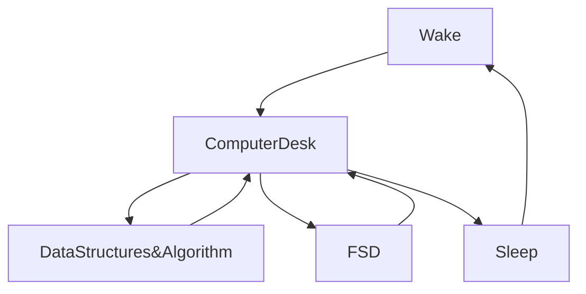

[](https://git.io/typing-svg)


[](https://wakatime.com/@fc738f08-9e9d-4e8b-a6ea-7f547f91629d)

<h2>Hey 👋, I'm <a href="https://github.com/IshwaranRudhara">Ishwaran</a> </h2>

[](https://git.io/typing-svg)


<!--START_SECTION:waka-->


**🐱 My GitHub Data** 

> 🏆 47 Contributions in the Year 2023
 > 
> 📦 836.9 kB Used in GitHub's Storage 
 > 
> 💼 Opted to Hire
 > 
> 📜 95 Public Repositories 
 > 
> 🔑 166 Private Repositories  
 > 
**I'm an Early 🐤** 

```text
🌞 Morning    7 commits      ░░░░░░░░░░░░░░░░░░░░░░░░░   2.92% 
🌆 Daytime    137 commits    ██████████████░░░░░░░░░░░   57.08% 
🌃 Evening    74 commits     ███████░░░░░░░░░░░░░░░░░░   30.83% 
🌙 Night      22 commits     ██░░░░░░░░░░░░░░░░░░░░░░░   9.17%

```
📅 **I'm Most Productive on Sunday** 

```text
Monday       31 commits     ███░░░░░░░░░░░░░░░░░░░░░░   12.92% 
Tuesday      30 commits     ███░░░░░░░░░░░░░░░░░░░░░░   12.5% 
Wednesday    16 commits     █░░░░░░░░░░░░░░░░░░░░░░░░   6.67% 
Thursday     9 commits      █░░░░░░░░░░░░░░░░░░░░░░░░   3.75% 
Friday       13 commits     █░░░░░░░░░░░░░░░░░░░░░░░░   5.42% 
Saturday     30 commits     ███░░░░░░░░░░░░░░░░░░░░░░   12.5% 
Sunday       111 commits    ███████████░░░░░░░░░░░░░░   46.25%

```


📊 **This Week I Spent My Time On** 

```text
⌚︎ Time Zone: Asia/Kolkata

💬 Programming Languages: 
Other                    37 hrs 43 mins      ███████████████████████░░   91.71% 
HTML                     1 hr 12 mins        ░░░░░░░░░░░░░░░░░░░░░░░░░   2.94% 
JavaScript               1 hr 2 mins         ░░░░░░░░░░░░░░░░░░░░░░░░░   2.53% 
PHP                      43 mins             ░░░░░░░░░░░░░░░░░░░░░░░░░   1.77% 
CSS                      20 mins             ░░░░░░░░░░░░░░░░░░░░░░░░░   0.83%

🔥 Editors: 
Browser                  37 hrs 43 mins      ███████████████████████░░   91.69% 
VS Code                  3 hrs 25 mins       ██░░░░░░░░░░░░░░░░░░░░░░░   8.31%

💻 Operating System: 
Windows                  41 hrs 8 mins       █████████████████████████   100.0%

```

**I Mostly Code in Python** 

```text
Python                   54 repos            ████████████████░░░░░░░░░   65.06% 
HTML                     12 repos            ███░░░░░░░░░░░░░░░░░░░░░░   14.46% 
JavaScript               10 repos            ███░░░░░░░░░░░░░░░░░░░░░░   12.05% 
Dockerfile               2 repos             ░░░░░░░░░░░░░░░░░░░░░░░░░   2.41% 
CSS                      2 repos             ░░░░░░░░░░░░░░░░░░░░░░░░░   2.41%

```


**Timeline**

 


 Last Updated on 17/01/2023 13:01:33 UTC
<!--END_SECTION:waka-->

```javascript


```


[](https://git.io/streak-stats)

[](https://github.com/anuraghazra/github-readme-stats)


<H2>My Routine Since JAN 2021</H2>


[](https://github.com/ashutosh00710/github-readme-activity-graph)


<!--
**IshwaranRudhara/IshwaranRudhara** is a ✨ _special_ ✨ repository because its `README.md` (this file) appears on your GitHub profile.

Here are some ideas to get you started:

- 🔭 I’m currently working on ...
- 🌱 I’m currently learning ...
- 👯 I’m looking to collaborate on ...
- 🤔 I’m looking for help with ...
- 💬 Ask me about ...
- 📫 How to reach me: ...
- 😄 Pronouns: ...
- ⚡ Fun fact: ...
-->
